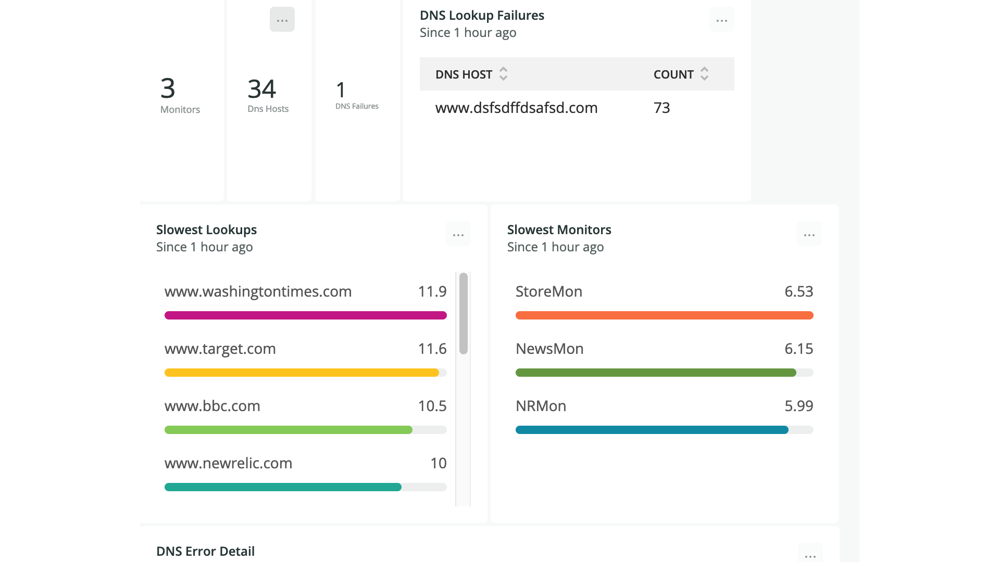

[](https://opensource.newrelic.com/oss-category/#new-relic-experimental)

# [Simple DNS Monitor]

>This project is a quick and dirty DNS Monitor for New Relic.  It runs in a Docker Container or Kubernetes and polls specified DNS hosts.  This DNS monitor will determine if the host resolves as well as the time the resolution takes.  The monitor will report the ip(s) the hosts resolve to as well as the CNAME if applicable.


## Installation


###Required Environment Variables

```NEWRELIC_KEY=Your NewRelic Key

MONITOR_NAME=NICKT1 Monitor Name

POLL_INTERVAL=45 Number of seconds between polls

dns.host.0=www.newrelic.com

dns.host.1=www.google.com

...

dns.host.99= Up to 100 hosts to monitor
```
###Run in Docker
Copy .env.template to .env Add domains to monitor, a monitor name and a New Relic license key.  Be sure to include the monitor name as
dashboards depend on it

docker build . -t dnsmon

docker run --env-file .env dnsmon


## Getting Started
>Run in docker using above instructions.  Copy .env.template to .env .  Add your New Relic license key.  Add the domains you wish to monitor.  Optionally set the polling interval.

## Usage
>Query the Events listed below.  You may also import dns_dashboard.json and use it as is or as the basis for building your own.


##Generated events
####DnsMon:

dns_error set to 1 if error

duration set to ms for DNS lookup

####DNSMonTick:
Metadata about state of DNS monitor sent evey three minutes


## Support

New Relic hosts and moderates an online forum where customers can interact with New Relic employees as well as other customers to get help and share best practices. Like all official New Relic open source projects, there's a related Community topic in the New Relic Explorers Hub. You can find this project's topic/threads here:

>Add the url for the support thread here

## Contributing
We encourage your contributions to improve [project name]! Keep in mind when you submit your pull request, you'll need to sign the CLA via the click-through using CLA-Assistant. You only have to sign the CLA one time per project.
If you have any questions, or to execute our corporate CLA, required if your contribution is on behalf of a company,  please drop us an email at opensource@newrelic.com.

**A note about vulnerabilities**

As noted in our [security policy](../../security/policy), New Relic is committed to the privacy and security of our customers and their data. We believe that providing coordinated disclosure by security researchers and engaging with the security community are important means to achieve our security goals.

If you believe you have found a security vulnerability in this project or any of New Relic's products or websites, we welcome and greatly appreciate you reporting it to New Relic through [HackerOne](https://hackerone.com/newrelic).

## License
[Project Name] is licensed under the [Apache 2.0](http://apache.org/licenses/LICENSE-2.0.txt) License.
>[If applicable: The [project name] also uses source code from third-party libraries. You can find full details on which libraries are used and the terms under which they are licensed in the third-party notices document.]
